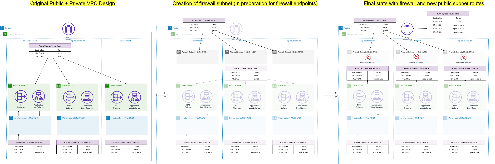

# VPC with network firewall

This configuration creates a VPC with the following resources across multiple AZs

- Internet gateway
- NAT gateway per AZ
- public, private and firewall subnets
- AWS network firewall

The routing tables for such a deployment model follows the [AWS blog suggestion](https://aws.amazon.com/blogs/networking-and-content-delivery/deployment-models-for-aws-network-firewall/), particularly "2) AWS Network Firewall is deployed to protect traffic between an AWS service in a public subnet and IGW"

## Usage

To run this example you need to execute:

```bash
$ terraform init
$ terraform plan
$ terraform apply
```

Note that this example may create resources which can cost money (AWS Elastic IP, for example). Run `terraform destroy` when you don't need these resources.

## Architecture



## Requirements

| Name | Version |
|------|---------|
| <a name="requirement_terraform"></a> [terraform](#requirement\_terraform) | >= 0.14.8 |
| <a name="requirement_aws"></a> [aws](#requirement\_aws) | >= 3.16 |

## Providers

| Name | Version |
|------|---------|
| <a name="provider_aws"></a> [aws](#provider\_aws) | 3.52.0 |

## Modules

| Name | Source | Version |
|------|--------|---------|
| <a name="module_vpc"></a> [vpc](#module\_vpc) | ../../ | n/a |

## Resources

| Name | Type |
|------|------|
| [aws_networkfirewall_firewall_policy.example](https://registry.terraform.io/providers/hashicorp/aws/latest/docs/resources/networkfirewall_firewall_policy) | resource |
| [aws_networkfirewall_rule_group.example](https://registry.terraform.io/providers/hashicorp/aws/latest/docs/resources/networkfirewall_rule_group) | resource |

## Inputs

No inputs.

## Outputs

| Name | Description |
|------|-------------|
| <a name="output_firewall_subnets"></a> [firewall\_subnets](#output\_firewall\_subnets) | List of IDs of firewall subnets |
| <a name="output_nat_public_ips"></a> [nat\_public\_ips](#output\_nat\_public\_ips) | List of public Elastic IPs created for AWS NAT Gateway |
| <a name="output_network_firewall_arn"></a> [network\_firewall\_arn](#output\_network\_firewall\_arn) | ARN of the Network Firewall |
| <a name="output_private_subnets"></a> [private\_subnets](#output\_private\_subnets) | List of IDs of private subnets |
| <a name="output_public_subnets"></a> [public\_subnets](#output\_public\_subnets) | List of IDs of public subnets |
| <a name="output_vpc_id"></a> [vpc\_id](#output\_vpc\_id) | The ID of the VPC |
