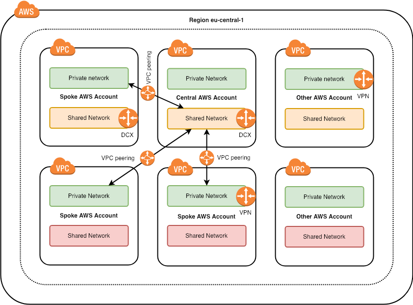

# VPC with separate shared subnets and route tables

Configuration in this directory creates set of VPC resources which may be sufficient for staging or production environment (look into [simple-vpc](../simple-vpc) for more simplified setup).

There are a public, private, database, ElastiCache, Redshift subnets, NAT Gateways created in each availability zone.

**This example additionally sets up shared subnets and route table**.



The shared subnets feature is useful in a situation where you want to share your resource among other AWS accounts and you can't use PrivateLink technology.

You can share resources in the AWS environment  by using:

* [AWS VPC Peering](https://docs.aws.amazon.com/vpc/latest/userguide/vpc-peering.html)

* [VPC Sharing](https://aws.amazon.com/blogs/networking-and-content-delivery/vpc-sharing-a-new-approach-to-multiple-accounts-and-vpc-management/)

With additional route table for shared subnets, you can set up VPC peering between AWS accounts and enforce that only those shared subnets can reach other accounts.

Also in some cases shared subnets will be only resources that you allow to be reachable from an on-premise data centre via VPN or Direct Connect.
That's why you can control it by using "propagate_shared_route_tables_vgw" variable.

## Usage

To run this example you need to execute:

```bash
$ terraform init
$ terraform plan
$ terraform apply
```

Note that this example may create resources which can cost money (AWS Elastic IP, for example). Run `terraform destroy` when you don't need these resources.

<!-- BEGINNING OF PRE-COMMIT-TERRAFORM DOCS HOOK -->

## Outputs

| Name | Description |
|------|-------------|
| database\_subnets | List of IDs of database subnets |
| elasticache\_subnets | List of IDs of elasticache subnets |
| nat\_public\_ips | List of public Elastic IPs created for AWS NAT Gateway |
| private\_subnets | List of IDs of private subnets |
| public\_subnets | List of IDs of public subnets |
| redshift\_subnets | List of IDs of elasticache subnets |
| shared\_subnets | List of IDs of elasticache subnets |
| vpc\_id | The ID of the VPC |

<!-- END OF PRE-COMMIT-TERRAFORM DOCS HOOK -->
